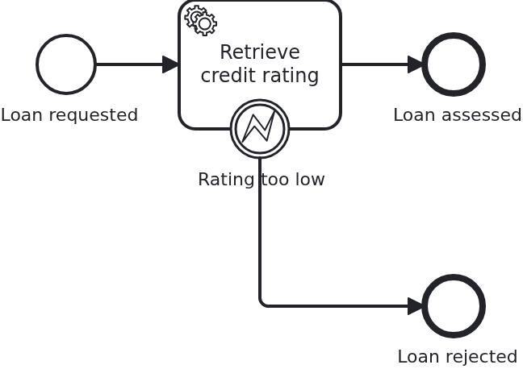

# Service tasks

[](./LICENSE)

A service task is the place where a process asks your application to do something. This
blueprint answers the question that comes right after wiring one up: what happens when the
work does not simply succeed? A provider is unreachable, or the answer it gives means the
business case is over. The two look similar in code and could hardly be more different for
the process.

## What this blueprint shows



The loan approval of the base blueprint, but the service task now asks a rating provider,
and a provider can behave in three ways. Each one leaves the workflow somewhere else:

- It answers, and the rating is good enough. The handler returns, VanillaBP saves the
  aggregate, and the process continues on the regular sequence flow.
- It does not answer. `CreditRatingUnavailableException` leaves the handler, the
  transaction is rolled back and the BPMS delivers the task again. The model knows nothing
  about this, and it should not: a provider having a bad minute is not a business case.
- It answers, but the rating is below the minimum. The handler writes the rejection onto
  the aggregate and throws `TaskException`. The workflow leaves the task through the error
  boundary event, and what the handler wrote before throwing is saved anyway.

The third one is the surprising one, so it is worth spelling out. A `TaskException` is not
a failure. It is a business outcome the BPMN models, so VanillaBP commits the transaction
and the process takes the error path. Every other exception is a failure, and failures
leave no trace.

Two more things this blueprint carries:

- The rating provider is an input mapping of the BPMN task (`ratingProvider`), bound to a
  `@TaskParam` of the handler. Which provider is asked is modelled, not compiled in.
- `Service#assessCreditRating` returns immediately if the aggregate already carries a
  rating. A remote BPMS may deliver a task more than once, and asking a provider twice may
  cost money. Idempotency is keyed on the state of the aggregate, never on a counter of
  invocations.

## Delta to the base blueprint

Compared to [`module-single`](https://github.com/vanillabp-blueprints/module-single-quarkus):

|                  File                   |                                                What is different                                                 |
|-----------------------------------------|------------------------------------------------------------------------------------------------------------------|
| `loan_approval.bpmn`                    | an error boundary event on the service task, plus the input mapping `ratingProvider`                             |
| `CreditRatingClient.java`               | new: the port to the surrounding system the task talks to                                                        |
| `LocalCreditRatingClient.java`          | new: a stand-in provider, so the blueprint runs without one                                                      |
| `CreditRatingUnavailableException.java` | new: the technical failure the BPMS retries                                                                      |
| `Service.java`                          | asks the provider, rejects a rating below the minimum with `TaskException`, and returns early if a rating exists |
| `WorkflowTaskHandler.java`              | takes the provider as `@TaskParam`; no `@Transactional`                                                          |
| `Aggregate.java`                        | `ratedBy` and `rejectionReason` in addition to the rating                                                        |
| `LoanApprovalIT.java`                   | one test per outcome, with a simulator standing in for the provider                                              |

The one difference worth understanding is the missing `@Transactional`. VanillaBP runs a
task handler in a transaction it owns and commits it for a `TaskException` deliberately. A
transaction declared by the application would roll that back and throw away the rejection
the process is about to react to.

You do not have to remember that. An annotation on the handler or its class fails the boot
with a message naming the method, and one on a bean the handler calls fails the task while it
runs. What used to leave a rejected loan looking untouched in the database now stops the
application instead.

## Running it

Requires a JDK 21. Camunda 7 is embedded, so nothing else has to run:

```bash
mvn install verify
```

Running it on another BPMS is a Maven profile, not one line of Java changes:

```bash
mvn install verify -Pcamunda8
```

Camunda 8 is a remote engine, so a cluster has to run. Start one; its address, and everything
else specific to that engine, lives in its profile file
`application/src/main/resources/application-camunda8.yaml`, with a copy for the module's own
test:

```yaml
vanillabp:
  adapters:
    camunda8:
      # Camunda 8 is a remote engine: point this at your cluster.
      rest-address: http://localhost:8080
```

That file is loaded because the Maven profile `camunda8` makes the config profile of the same
name the parent of whichever profile the application runs in, so the engine is chosen once, on
the Maven command line, and the build, the tests and `quarkus:dev` all follow it.

Start the application:

```bash
mvn -pl application quarkus:dev
```

Booting logs a warning per workflow module: both Camunda adapters start out with
`name-clash-avoidance: none`, so nothing keeps the identifiers of one workflow module apart
from those of another, and the adapter asks for a decision instead of picking one. One module
cannot collide with itself, so this blueprint leaves it at that. Answering the question is one
property, `vanillabp.adapters.<id>.accept-unscoped-identifiers: true`, and the modes a BPMS
offers are in
[the wiki](https://github.com/vanillabp/adapter-platform-integration/wiki/Workflow-modules#how-name-clashes-are-avoided).

Start a loan approval. This is the only URL you need:

```
http://localhost:8080/api/loan-approval/start?amount=5000
```

The stand-in provider refuses the first request for every loan request, so the first thing
in the log is the retry:

```
Loan approval '0f7c…' started
Rating provider 'acme-rating' is not answering for loan approval '0f7c…'. The BPMS will retry the task.
Credit rating of loan approval '0f7c…' is 50, awarded by 'acme-rating'
Show the result -> http://localhost:8080/api/loan-approval/0f7c…
```

Ask for a small amount to see the other outcome. A rating of 5 is below the configured
minimum of 10, so the loan is rejected and the workflow ends through the error boundary
event:

```
http://localhost:8080/api/loan-approval/start?amount=500
```

```
Credit rating of loan approval '4b21…' is 5, awarded by 'acme-rating'
Loan approval '4b21…' is rejected: rating 5 is below the minimum of 10
```

Opening the result URL shows the aggregate with the rejection reason on it. That it is
there is the point: the handler threw, and the state survived.

Both switches are in the module's own configuration
(`loan-approval/src/main/resources/loan-approval/loan-approval.yaml`): turn
`fail-first-rating-attempt` off for an undisturbed run, or move `minimum-rating` to decide
which amounts are rejected.

## How it works

|                                          File                                          |                                                             Role                                                             |
|----------------------------------------------------------------------------------------|------------------------------------------------------------------------------------------------------------------------------|
| `loan-approval/src/main/resources/loan-approval/processes/camunda7/loan_approval.bpmn` | the process: service task with an input mapping and an error boundary event catching `loan-rejected`                         |
| `.../loanapproval/WorkflowTaskHandler.java`                                            | the `@WorkflowTask` method, taking the aggregate and the `@TaskParam`, calling `Service` and letting every exception through |
| `.../loanapproval/Service.java`                                                        | the work behind the task: ask the provider, rate, reject with `TaskException`                                                |
| `.../loanapproval/CreditRatingClient.java`                                             | the port to the surrounding system, so a test can replace it                                                                 |
| `.../loanapproval/LocalCreditRatingClient.java`                                        | the stand-in provider, refusing the first request per loan request                                                           |
| `.../loanapproval/model/Aggregate.java`                                                | rating, provider and rejection reason, which is all the state there is                                                       |
| `loan-approval/src/test/.../CreditRatingSimulator.java`                                | the provider as the test needs it: it records requests and can be told to refuse them                                        |
| `loan-approval/src/test/.../LoanApprovalIT.java`                                       | one test per outcome: rated, retried, rejected                                                                               |

The order of events: `ApiController` calls `Service#initiateLoanApproval`, which builds the
aggregate and tells `Workflow` that a loan was requested. `Workflow#loanRequested` calls
`ProcessService#startWorkflow`, so aggregate and workflow are created in one transaction.
The BPMS reaches the service task and calls `WorkflowTaskHandler#retrieveCreditRating` with
the aggregate and the mapped provider, which hands over to `Service#assessCreditRating`.
From there the three outcomes above apply, and the aggregate is saved unless the handler
failed technically.

The tests wait rather than assert immediately. A BPMS runs tasks in transactions of its own,
and a retry needs a moment to come around. Asserting right after having started a workflow
would pass on an embedded engine and fail on a remote one.

## Documentation

- [What happens when my handler throws?](https://github.com/vanillabp/adapter-platform-integration/wiki/Workflow-tasks#what-happens-when-my-handler-throws): the three outcomes, as a contract that holds on every BPMS
- [The execution contract](https://github.com/vanillabp/adapter-platform-integration/wiki/Workflow-tasks#the-execution-contract): who loads, who saves and who owns the transaction
- [Parameters](https://github.com/vanillabp/adapter-platform-integration/wiki/Workflow-tasks#parameters): `@TaskParam` and everything else a handler may ask for
- [Wire up a task](https://github.com/vanillabp/spi-for-java#wire-up-a-task): the annotations used in `WorkflowTaskHandler.java`
- the wiki of the [BPMS adapter](https://github.com/vanillabp/adapter-platform-integration/wiki/BPMS-adapters) you use: how often a failed task is retried, and how long it waits

This blueprint is developed in the monorepo
[`blueprints`](https://github.com/vanillabp-blueprints/blueprints). This repository is a
read-only mirror, **issues and pull requests belong there.**

## Noteworthy & Contributors

[VanillaBP](https://www.github.com/vanillabp/spi-for-java) was developed by [Phactum](https://www.phactum.at) with the
intention of giving back to the community as it has benefited the community in the past.


## License

Copyright 2026 Phactum Softwareentwicklung GmbH

Licensed under the Apache License, Version 2.0
